**disclaimer:** This is a bit of a personal experimentation project rather than a polished presentation project.

The intention of this project is to make a back end for games I might build that would run in the browser.

- allow saving the game - both the structured meta (to postgres) and unstructured game state (to mongodb). (actually it would be better to use a jsonb data type in postgres, but I just wanted to experiment with mongodb)
- authentication + authentication roles
- allow users to rate games
- etc

Focus is on the BE, but there's a small FE implemented. Styling etc has not been a focus.

BE is currently using a structure like: middleware -> controllers -> orchestrators -> workers -> repositories -> db

This structure (imports) is enforced in eslint rules backend/eslint.config.js .

(Although this structure is not always consistently implemented, with some 'services' remaining, waiting to be refactored)

## setup

The project is split by directory `backend` and `frontend`. `backend` runs in docker.

key commands (package.json)

**BE:**
- `dev` - start everything
- `db:generate`
- `db:migrate`
- `db:seed`
- `db:studio` - open up a gui visualiser
- `db:studio:mongo` - visualiser for mongodb

databses is running on localhost:3000

api docs available at localhost:3000/docs

**FE:**
- `dev`

## databses

postgres schema:

I would like to use a few different DBs, just for my own fun:

- relational DB (e.g. postgresql) for player info. amount of time played. record of game sessions? Achievements?
- document DB (e.g. mongodb) for the game state (it's got some unknown structure)
- key-value (e.g. redis) for user session state? or caching?
- IndexedDB (on front end) for local save state. auto save.

slightly optional:
- analytics db (clickhouse/timescaledb) - could just include "most time played" and update automatically? "player progression" ?
- vector database - I can't yet think of a good use-case.
- redis pub/sub for real-time features?
- caching strategies?

ORMS:
- postgresql - Prisma
- mongodb - mongoose
- redis - no ORM. ioredis.
- clickhouse - no ORM (it's OLAP) - @clickhouse/client
- IndexedDB - dexie.js

## features

- pagination of back end endpoints (not yet)
- schema migrations
- tanstack query
- api documentation endpoint
- controller -> orchestrator -> worker -> repository pattern
- FE modal
- authenticated endpoints
- role based authentication
- BE/FE type generation
- relational db (postgres) , document db (mongodb)
- FE query caching via tanstack
- css variables (could be better)
- dto objects (could be better)
- db data seeding
- slightly more complex migration, adding column with required field: backend/prisma/migrations/20260505082239_add_updated_at_to_game_rating/migration.sql

**front end ui**

**apm for be performance monitoring**

